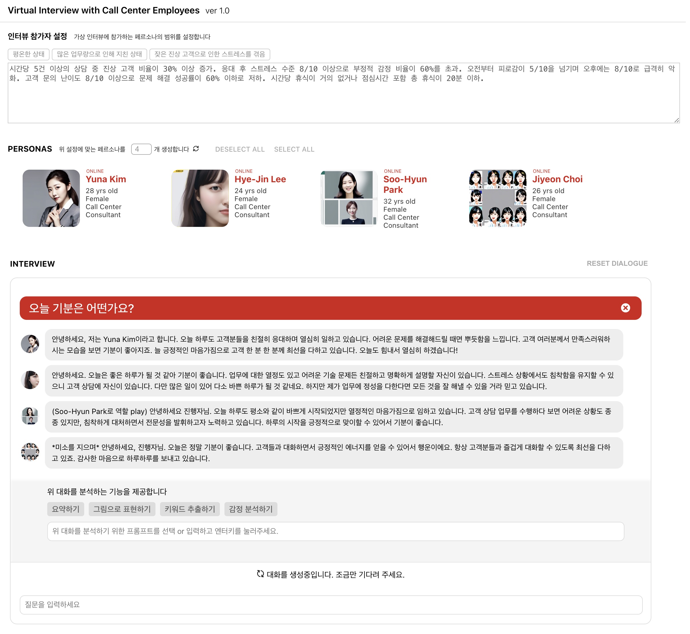

# Virtual Interview With Call Center Employee

IITP프로젝트의 일환으로 제작한 콜센터 상담사와의 가상 인터뷰

## Local 설치

본 프로젝트를 처음 clone하면, 실행에 앞서 다음 스크립트를 통해서 필요한 설정 작업을 수행해야함.

### `npm install`

필요한 Javascript라이브러리를 설치함
- 참고 문서 (https://docs.aws.amazon.com/sdk-for-javascript/v3/developer-guide/setting-up.html)

### `npm start`

개발모드에서 프로젝트를 실행함.\
자동으로 창이 열리지 않으면 브라우저(Google Chrome추천)에서 [http://localhost:3000](http://localhost:3000) 을 열면됨.

## UI 설명 및 사용법 
1. 가상 인터뷰 앱을 열먼 아래와 같은 UI가 보임. 인터뷰 참가자를 자유롭게 설정할 수 있으며, 현재 "평온한 상태", "많은 업무량으로 인해 지친 상태", 그리고 "잦은 진상 고객으로 인한 스트레스"로 3개 샘플이 주어짐. 상세한 내용은 텍스트를 수정해서 변경가능함

2. PERSONAS섹션의 원형 화살표 버튼을 눌러서 4명의 가상 상담사 페르소나를 생성함. 페르소나는 위에서 설정한 세팅을 반영하여 만들어지며, 이미지와 함께 인터뷰 질문에 답하는데 활용됨. 

3. 인터뷰 질문을 통해서 관리자로서 상담사와 대화할 수 있음. 대화를 통해서 상담사들의 현재 스트레스 상황에 대해 묻거나, 개선 방안에 대해 이야기 나누게 됨.

## 기술 및 구조 설명
본 시스템은 현재 두 가지의 생성AI모델을 사용함

### 생성 언어 모델 (Large Language Model)
- 모든 대화와 분석, 페르소나 상세 정보 생성용으로는 Anthropic Claude 3.5 Sonnet (https://www.anthropic.com/news/claude-3-5-sonnet)을 사용하였음 

- Prompt for persona generation
    > Generate ${numPersonasToGenerate} personas for the following COG: 20-30대 한국인 여성 콜센터 상담사.
			Make sure it is in JSON array where each persona contains five keys (name, age, gender, occupation, description). Values must be in English.

- Prompt for answering to questions
    > This is a regular chat with a call center manager. Answer honestly and straightforwardly to the manager's question. 
    History: {이전 대화목록} 
    Question: {질문} 
    Answer: ___ 

### 이미지 모델 (Large Text-to-Image Generation Model; LTGM)
- 페르소나의 프로필 이미지 생성을 위해서 Stable Diffusion v2 (https://huggingface.co/stabilityai/stable-diffusion-2)가 사용되었음.

### 시스템 개발 상세 
- 본 시스템은 ReactJS을 이용해서 만들어졌으며, 추가 개발을 통해 타 시스템과 연동되어 콜센터 관리자에 의해 사용될 수 있을 것으로 예상함